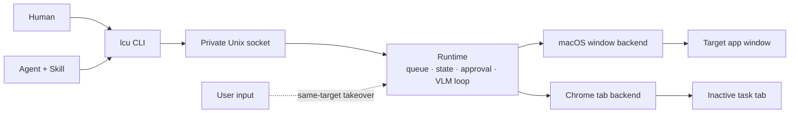

# AnythingUse

> One local control plane for anything an agent can operate.

AnythingUse is a local-first control layer for humans and Agents. It is designed to grow beyond a single device type: computers are the first endpoint, not the final boundary.

- **Today:** real macOS applications and the user's installed Chrome.
- **Future:** Windows and other endpoint types through the same command-oriented model.

中文简介：AnythingUse 是一个面向用户与 Agent 的本地多端控制层。当前实现 macOS Computer Use，后续将逐步扩展到更多系统与设备。

**Naming:** product name is **AnythingUse**. The public CLI is still `lcu`, crates and sockets use the historical **LCU** / `LocalComputerUse` codename (data root: `~/Library/Application Support/LocalComputerUse`). Treat them as one product.

## Why AnythingUse

Computer-use systems often take over the foreground desktop, move the real pointer, or force Agents into a browser-specific API. AnythingUse takes a different approach:

- **Shared interface:** humans and Agents use the same `lcu` command.
- **Local-first:** task state, screenshots, model inference, and approvals stay on the machine by default.
- **Coexists with the user:** background work targets a specific window or Chrome task tab instead of taking over the whole desktop.
- **Honest completion:** an action receipt is not success. A task succeeds only after explicit completion and target re-observation.
- **Endpoint-oriented:** the Runtime routes goals to a platform backend, so future endpoints do not need a new public Agent protocol.

## What works today

| Area | Current capability |
|---|---|
| macOS applications | Observe and operate a specific application window without activating it |
| Chrome | Use the user's real Chrome profile through an extension, Native Messaging, and an inactive task tab |
| Local model | Qwen3-VL subprocess actor for screenshot + accessibility-tree reasoning |
| Scheduling | One serial FIFO queue with pause, resume, cancel, and crash recovery |
| Safety | Effect-based risk checks, GUI-bound approval, target takeover detection |
| Agent access | Bundled Skill that invokes only the public `lcu` CLI |
| Persistence | Local SQLite task and event state |

The current implementation is a developer build for Apple Silicon macOS. It is not yet distributed as a signed installer.

## Architecture



The public boundary is intentionally small:

```text
natural-language goal
        ↓
      lcu CLI
        ↓
local Runtime: observe → propose → guard → act → observe
        ↓
macOS window or Chrome task tab
```

See [Architecture](docs/architecture.md) for the component and task-lifecycle details.

## Quick start

### Requirements

- Apple Silicon Mac
- Rust toolchain
- Screen Recording and Accessibility permissions
- Optional: Chrome plus the AnythingUse extension
- Optional: Qwen3-VL weights at `models/Qwen3-VL-4B-Instruct` (`./scripts/download_qwen3_vl.sh`)

### Build

```bash
cargo build -p lcu-cli -p lcu-desktop --release
(cd native/macos-window-service && swift build -c release)

# optional local VLM weights
./scripts/download_qwen3_vl.sh
```

### Start and diagnose

```bash
./target/release/lcu-desktop &
./target/release/lcu doctor --json
```

### Run a task

```bash
./target/release/lcu run \
  "Open Downloads in Finder" \
  --app com.apple.finder \
  --wait --json
```

Agent-originated tasks add display metadata; they do not use a separate privileged API:

```bash
./target/release/lcu run \
  "Open Downloads in Finder" \
  --app com.apple.finder \
  --source agent --source-name codex \
  --wait --json
```

### Enable Chrome

```bash
./native/chrome-control/scripts/install-native-host.sh
```

Then open `chrome://extensions`, enable Developer mode, choose **Load unpacked**, and select `native/chrome-control/extension`.

## Non-interference model

AnythingUse does not solve coexistence by pausing whenever the target application is frontmost.

- A macOS task is bound to a specific PID and window.
- Background semantic actions do not activate the target window.
- If the user takes over that exact window, the task pauses and releases execution.
- Chrome work runs in an inactive task tab and does not reactivate the user's previous or task tab.
- If strict target identity cannot be maintained, the operation fails instead of guessing another window.

This is a product invariant. Switching to the target and switching back is not considered non-interference.

## Queue and completion

There is one serial FIFO queue per macOS login user. Tasks waiting for approval or paused by the user release the execution slot.

A task reaches `succeeded` only when:

1. the model emits explicit `Done`;
2. the target can be observed again; and
3. the Runtime records the terminal result.

Repeated actions, step count, or a successful write do not complete the whole goal.

## Roadmap

- **Now (v3.2, on `main`):** macOS window control, real Chrome control, local VLM, CLI, Agent Skill. See [Delivery status](docs/status.md).
- **Next:** signed macOS packaging and Windows compatibility.
- **Later:** additional computers, mobile devices, remote hosts, or other controllable endpoints where a strict target and safe action model can be provided.

Roadmap items describe direction, not release commitments. MCP, Playwright, public TCP, and long Top100/soak gates are **not** current product surfaces or freeze blockers.

## Repository map

```text
apps/lcu-desktop/             Runtime host and approval UI
crates/lcu-cli/               Public command surface
crates/lcu-core/              Shared contracts (actions, risk, task state, protocol)
crates/lcu-platform/          PlatformBackend trait + null backend
crates/lcu-runtime/           Queue, state, policy, and execution loop
crates/lcu-model/             Local VLM actor and action validation
crates/lcu-platform-macos/    Rust adapter for macOS control
crates/lcu-chrome/            Chrome backend adapter
native/macos-window-service/  Swift window-targeted service
native/chrome-control/        Extension and Native Messaging host
skills/local-computer-use/    Agent-facing Skill (directory name historical)
scripts/                      Model download and helper scripts
```

## Documentation

- [Delivery status](docs/status.md)
- [Architecture](docs/architecture.md)
- [User guide](docs/user-guide.md)
- [`lcu` command contract](docs/command-contract.md)
- [Privacy](docs/privacy.md)
- [Troubleshooting](docs/troubleshooting.md)
- [Agent Skill](skills/local-computer-use/SKILL.md)
- [macOS window service](native/macos-window-service/README.md)
- [Chrome control](native/chrome-control/README.md)
