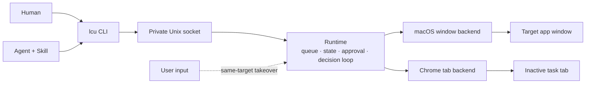

# AnythingUse

> One local control plane for anything an agent can operate.

**中文版：[README.zh-CN.md](README.zh-CN.md)**

AnythingUse is a local-first control layer for humans and Agents. **Today:** real macOS applications and the user's installed Chrome. **In progress:** Android through the separate `lau` CLI. **Future:** Windows and other endpoint types through the same command-oriented model.

**Naming:** product name is **AnythingUse**. The computer CLI is `lcu` (**Local Computer Use**); crates, sockets, and the CLI keep the historical **LCU** codename. **Android is not `lcu`**: its endpoint CLI is `lau` (**Local Android Use**), reserved for that surface. The data root is `~/Library/Application Support/AnythingUse`.

## Why AnythingUse

Computer-use systems often take over the foreground desktop, move the real pointer, or force Agents into a browser-specific API. AnythingUse takes a different approach:

- **Shared interface:** humans and Agents use the same `lcu` command.
- **Local-first:** task state, screenshots, model inference, and approvals stay on the machine by default.
- **Coexists with the user:** background work targets a strict window or inactive Chrome task tab. `auto` may bring the exact window forward when background delivery is unavailable; `background_only` never does. The app-access dialog discloses this fallback, the agent never switches back, and real user input on that target pauses automatically.
- **Honest completion:** an action receipt is not success; a task succeeds only after explicit completion and target re-observation.
- **Endpoint-oriented:** the Runtime routes goals to a platform backend, so future endpoints do not need a new public Agent protocol.

## What works today

| Area | Current capability |
|---|---|
| macOS applications | Window capture and AX/targeted actions on a strict PID + window target; background first, disclosed exact-target foreground fallback in `auto`, explicit failure in `background_only` |
| Chrome | The user's real Chrome profile via extension + Native Messaging on an inactive task tab |
| Android (`lau`) | Source-level WIP on a **separate** CLI (`lau`, never `lcu`): ADB observation, an on-device AccessibilityService helper for semantic `dump`/`invoke`/`set_value`/`scroll`, and an on-demand daemon for `run`/`decide`/`act`. ADB stays transport-only. Not productized (no installer, no Android Skill) and the safety model is still incomplete — see the [LAU plan](docs/lau-android-plan.md) |
| Decision maker | External Agent by default when `LCU_VISION_ACTOR` is unset/`auto`; local Qwen3-VL is optional (`--actor vlm`) |
| Scheduling | One serial FIFO queue with pause, resume, cancel, and crash recovery |
| Safety | Shared closed-set effect, independent Runtime risk floor, separate app-access and consequence gates, takeover detection |
| Persistence | Local SQLite task and event state |

These are implemented source-level contracts, not a broad real-app
compatibility or stability certification. Runtime verification remains
scenario-specific.

The current implementation is a developer build for Apple Silicon macOS (no signed installer yet).

## Architecture



The loop is `observe → decide → guard → act → observe`. `decide` is the pluggable step: with the normal unset/`auto` Runtime default, the external Agent fetches the observation (`lcu decide`) and submits one (`lcu act`); the local VLM is optional (`lcu run --actor vlm`). Both flow through the same validation, risk, and approval gates. Agents invoke `lcu` directly (no driver script); `decide` returns compact elements + `image_path` for the caller to extract — not a full semantic tree. See [Architecture](docs/architecture.md) for details.

## Quick start

```bash
# build
cargo build -p lcu-cli -p lcu-desktop --release
(cd native/macos-window-service && swift build -c release)

# product PATH entry (sibling lcu + lcu-desktop in ~/.local/bin)
./scripts/install-cli.sh
lcu doctor --json

# external Agent path: the Skill continues with lcu decide / lcu act
lcu run "Open Downloads in Finder" \
  --app com.apple.finder --actor agent --json

# human/local path: requires the optional model assets below
lcu run "Open Downloads in Finder" \
  --app com.apple.finder --actor vlm --wait --json
```

An on-demand Runtime exits after 60 idle seconds once no task or approval is
active. Launch `lcu-desktop` yourself only when you want the menu-bar Runtime
to remain resident.

Agents use the bundled Skill; `--source` is display-only metadata.

Optional: Chrome surface — run `./native/chrome-control/scripts/install-native-host.sh`, then in `chrome://extensions` enable Developer mode and **Load unpacked** only from the `extension:` path it prints (default: `~/Library/Application Support/AnythingUse/chrome-extension`). Local VLM: `python3 -m venv .venv && .venv/bin/pip install -r requirements.txt`, then `./scripts/download_qwen3_vl.sh`.

## Install the Skill as a plugin

Two skills ship from this repo: **`local-computer-use`** (macOS apps + Chrome, via `lcu`) and **`local-android-use`** (a USB-connected Android device, via `lau`). **Install** (one of):

```bash
# Pi (native package; use an absolute path for global install)
pi install git:github.com/HelloiOS2014/AnythingUse
# or: ./scripts/install-pi.sh  (git package + PATH binaries; not this checkout)

# Claude Code
claude plugin marketplace add HelloiOS2014/AnythingUse
claude plugin install anythinguse

# Grok Build
grok plugin install https://github.com/HelloiOS2014/AnythingUse --trust
```

This checkout also autoloads the skill for Pi via `.pi/settings.json` after the
project is trusted. Product binaries live on PATH: `./scripts/install-cli.sh`
links sibling `lcu` and `lcu-desktop` into `~/.local/bin` (Pi:
`./scripts/install-pi.sh` runs that too). Checkout `./target/release/lcu` is a
debug fallback only.

**Update**:

```bash
# Pi local checkout is live (no copy). Git install:
pi install git:github.com/HelloiOS2014/AnythingUse
claude plugin update anythinguse    # or: grok plugin update
```

Skill updates ride the repo; the `lcu` / `lcu-desktop` binaries stay a separate
PATH install (`./scripts/install-cli.sh`).

## Non-interference model

Coexistence is not "pause whenever the target app is frontmost":

- A macOS task is bound to a specific PID and window; background semantic/targeted input is preferred. App access discloses that `auto` may activate that exact target when background delivery is unavailable; `background_only` fails instead.
- App access and consequence confirmation/takeover are separate decisions. Activation or approval discards the old proposal and returns a fresh observation to the same Actor.
- The agent never switches back. While the Actor thinks, the generic target reservation is released; continuation re-resolves and re-observes the target. Real user input on that target pauses automatically (Input Monitoring permission is required for macOS control).
- Chrome work runs in an inactive task tab and never reactivates the user's tabs.
- If strict target identity cannot be maintained, the operation fails rather than guessing another window.
- Consequences (send/delete/pay/…) use one-time confirmation or takeover even inside an approved session.

Apps that expose no usable Accessibility controls are observation-only unless
an existing PID-directed action can prove safe delivery, or `auto` activates
the exact permitted target and re-observes it. AnythingUse never activates a
different window or switches back afterwards.

This is a product invariant. Switching to the target and switching back without
approval is not non-interference.

## Queue and completion

One serial FIFO queue per macOS login user; `waiting_actor` and paused tasks release the global execution slot and generic target reservation. A task reaches `succeeded` only when the Actor emits explicit `Done` **and** the target can be observed again.

## Roadmap

- **Now (v3.2, on `main`):** macOS window control, real Chrome control, pluggable decision maker, CLI, Agent Skill. See [Delivery status](docs/status.md).
- **Next:** signed macOS packaging, Windows compatibility, and finishing the Android endpoint (`lau`: app-access gate, Android evidence layer, packaging). See the [LAU plan](docs/lau-android-plan.md).
- **Later:** remote hosts and other controllable endpoints with a strict target and safe action model.

MCP, Playwright, public TCP, and long Top100/soak gates are **not** current product surfaces or freeze blockers.

## Repository map

```text
apps/lcu-desktop/             Runtime host and approval UI
package.json                  Pi package manifest (ships the Skill)
.pi/settings.json             Project-local Pi package autoload
crates/anything-core/         Platform-neutral contracts (actions, risk, task state, protocol)
crates/lcu-core/              macOS layer: re-exports anything-core + the macOS evidence guard
crates/lcu-cli/               Public command surface
crates/lau-cli/               Android endpoint CLI + on-demand daemon (not productized)
crates/lcu-platform/          PlatformBackend trait + null backend
crates/lcu-runtime/           Queue, state, policy, and execution loop
crates/lcu-model/             Decision actors (VLM subprocess / AgentActor) + validation
crates/lcu-platform-macos/    Rust adapter for macOS control
crates/lcu-chrome/            Chrome backend adapter
native/macos-window-service/  Swift window-targeted service
native/chrome-control/        Extension and Native Messaging host
native/android-helper/        Kotlin AccessibilityService helper APK (`lau`)
skills/local-computer-use/    Agent Skill for macOS/Chrome (directory name historical)
skills/local-android-use/     Agent Skill for Android (`lau`)
scripts/                      Model download and helper scripts
```

## Documentation

- [Execution contract](docs/execution-contract.md) · [Delivery status](docs/status.md) · [Architecture](docs/architecture.md) · [Computer Use reference notes](docs/computer-use-reference.md) · [User guide](docs/user-guide.md) · [`lcu` command contract](docs/command-contract.md) · [LAU Android plan](docs/lau-android-plan.md) · [Privacy](docs/privacy.md) · [Troubleshooting](docs/troubleshooting.md)
- [Agent Skill](skills/local-computer-use/SKILL.md) · [macOS window service](native/macos-window-service/README.md) · [Chrome control](native/chrome-control/README.md)
