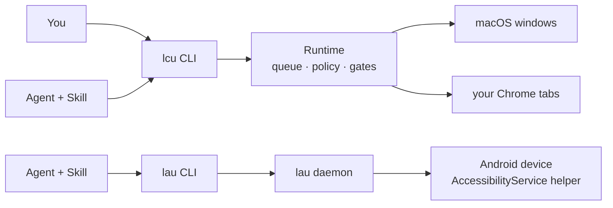

# AnythingUse

**Let an agent drive your real Mac, your real Chrome, and — source-level — your real Android phone. Locally, and with a human in the loop for anything risky.**

AnythingUse is a local-first control plane. It does not guess pixels or open a
throwaway browser: it observes the accessibility tree of the app you actually
use, acts on a strict window target, and stops for you before anything with a
real consequence. No cloud, no account, no telemetry.

**中文版：[README.zh-CN.md](README.zh-CN.md)**



## What it gives you

- **Real semantics, not pixel guessing.** It reads the same accessibility tree
  VoiceOver uses, so it can name a button instead of hunting coordinates.
- **Your actual environment.** Your Chrome profile, already logged in, on an
  inactive task tab — not a fresh browser with none of your sessions.
- **It does not steal your desktop.** Work targets one PID + window and prefers
  background delivery; a disclosed fallback may bring *that exact window*
  forward, and real input from you pauses the task immediately.
- **Risky things stop.** Sending, deleting, paying or touching a credential is a
  separate human decision, even inside an approved session — and an approval is
  never replayed later.
- **Honest completion.** A receipt is not success: a task is `succeeded` only
  after an explicit `done` **and** a fresh observation of the target.

## Try it

```bash
# build + put the binaries on PATH (lcu, lcu-desktop, lau, macos-window-service)
cargo build -p lcu-cli -p lcu-desktop --release
(cd native/macos-window-service && swift build -c release)
./scripts/install-cli.sh

lcu doctor --json
```

`doctor` is the whole prerequisite list in one call:

```json
{ "status": "ok",
  "data": { "runtime_reachable": true,
            "private_entry": { "kind": "unix_socket", "listens_tcp": false, "socket_mode": "600" },
            "permissions": [ { "name": "screen_recording", "state": "granted", "required_for": ["observe"] },
                             { "name": "accessibility",    "state": "granted", "required_for": ["semantic_action", "targeted_input"] },
                             { "name": "input_monitoring", "state": "granted", "required_for": ["directed_input_same_window_takeover"] } ],
            "blockers": [] } }
```

Then run a task the way an agent does — one decision per observation:

```bash
lcu run "Open the Downloads folder" --app com.apple.finder --actor agent --json
lcu decide <task-id> --json                    # compact elements + observation token (+ 0600 screenshot path)
lcu act  <task-id> --observation-id <obs> \
  --action '{"kind":"semantic","type":"invoke","element_id":"e12"}' \
  --effect '{"kind":"navigate","summary":"open Downloads"}'
lcu result <task-id> --json                    # succeeded / failed / cancelled
```

Exit codes are stable and the same for both CLIs (`anything-core`'s `ExitCode`):
`0` ok · `2` waiting for a human · `3` task failed · `4` permission denied ·
`64` usage error · `69` runtime unavailable · `70` internal.

The Runtime starts on demand and exits after 60 idle seconds; run `lcu-desktop`
yourself only if you want a resident menu-bar host.

## Install

| Requirement | Needed for |
|---|---|
| macOS on Apple Silicon, Rust toolchain, Xcode command-line tools | the core build (Swift service included) |
| Chrome | the Chrome surface (`./native/chrome-control/scripts/install-native-host.sh`, then load the unpacked extension it prints) |
| Python 3 + model assets | **optional** local VLM decision maker (`python3 -m venv .venv && .venv/bin/pip install -r requirements.txt`, then `./scripts/download_qwen3_vl.sh`) |
| `adb` + an Android device | the Android endpoint (`./scripts/install-android-helper.sh`, then enable *AnythingUse LAU* in Accessibility) |

macOS asks for three permissions, each mapped to what it enables — `doctor`
prints the same mapping: **Screen Recording** (observe), **Accessibility**
(semantic and targeted input), **Input Monitoring** (detecting your own input on
the target so the task can yield).

## Two endpoints, two maturity levels

| | `lcu` — macOS + Chrome | `lau` — Android |
|---|---|---|
| Maturity | **delivered (v3.2)**: source-aligned, concentrated live acceptance passed 2026-08-17 | **source-level**: acceptance evidence is one device on 2026-09-15 |
| Target | one PID + window, or an inactive Chrome task tab | one USB-connected device, app access per package |
| Decisions | `run` / `decide` / `act` / `result`, `--actor agent` (default) or `--actor vlm` | `run` / `decide` / `act` / `result` (`--actor agent`) |
| Transport | private Unix socket to an on-demand Runtime | `adb forward` to an in-app AccessibilityService socket; ADB is **never** used to inject input |
| Gates | app access · consequence · takeover | app access (package + signing certificate) · consequence · takeover |
| Read more | [status](docs/status.md) · [command contract](docs/command-contract.md) | [LAU plan](docs/lau-android-plan.md) · [Acceptance evidence](evidence/lau/phase2-acceptance-2026-09-15.md) |

`lau` is a **separate binary** (`lau` = Local Android Use, never `lcu`); the two
share only the platform-neutral contracts in `crates/anything-core`.

## How it stays safe

The loop is always **observe → decide → guard → act → observe**, and the guard
never trusts the actor:

- **The actor proposes, the runtime decides the risk.** Your `--effect` claim is
  a closed-set statement of intent; an independent evidence layer (accessibility
  semantics on macOS, panel/label evidence on Android) can **raise** the risk
  floor but never lower it. Mis-declaring a destructive action as navigation
  still lands on the destructive gate.
- **Gates are separate decisions.** Application access, consequence (R3) and
  takeover (R4) are distinct; credentials are handed to the human, never typed.
  **An approval is never replayed** — after any gate the task must re-observe and
  propose again.
- **Strict identity.** An action is bound to the observation it was decided on
  (on Android, a session-scoped token re-validated node by node). If the UI moved
  or the session was rebuilt, the action fails closed instead of hitting whatever
  is there now.
- **Yours stays yours.** Real input on the target pauses the task; on Android a
  hardware-touch watch does the same, and a dead watch pauses rather than acting
  blind. Credential fields are flagged and their text is never read.
- **Completion is proven, not claimed.** `succeeded` requires an explicit `done`
  plus a successful re-observation. It proves the mechanism, not your goal — the
  actor is responsible for checking that what it sees is what you asked for.

Details: [execution contract](docs/execution-contract.md) ·
[architecture](docs/architecture.md) · [privacy](docs/privacy.md).

## Using it from an agent

Two skills ship from this repo and are updated with it:

```bash
# Pi
pi install git:github.com/HelloiOS2014/AnythingUse     # or ./scripts/install-pi.sh
# Claude Code
claude plugin marketplace add HelloiOS2014/AnythingUse && claude plugin install anythinguse
# Grok Build
grok plugin install https://github.com/HelloiOS2014/AnythingUse --trust
```

- macOS + Chrome → `local-computer-use` ([SKILL.md](skills/local-computer-use/SKILL.md))
- Android → `local-android-use` ([SKILL.md](skills/local-android-use/SKILL.md))

An agent drives the CLI **directly**, one decision per observation — no driver
script, no wrapper around the JSON, no private sockets. Hard rules and the exact
resolution order for the binaries are in [AGENTS.md](AGENTS.md).

## Status

- **macOS core — v3.2, on `main`:** macOS window control, real Chrome control,
  pluggable decision maker (agent by default, local Qwen3-VL optional), CLI,
  Agent Skill. See [delivery status](docs/status.md).
- **Android — source-level:** productized enough to install and ship (`lau` +
  helper APK + its own skill), device-verified, with a known-gap list in the
  [LAU plan](docs/lau-android-plan.md) §0.
- **Not claimed:** broad compatibility with arbitrary apps, a signed/notarized
  installer, soak or Top-100 gates, Windows, remote hosts. MCP, Playwright and a
  public TCP listener are deliberately not surfaces.

Known limitations we chose to live with for now: a HyperOS quirk that can disable
the accessibility service after the helper is killed (#17), a rare empty/truncated
daemon response (instrumented; idempotent reads retry once, actions never do)
(#19), and Android spinner/dropdown controls that advertise a scroll they cannot
perform (#27).

## Repository map

```text
crates/anything-core/         platform-neutral contracts (actions, effects, risk) shared by lcu and lau
crates/lcu-*/                 macOS runtime: CLI, queue, policy, model actors, platform + Chrome backends
crates/lau-cli/               Android endpoint: CLI + on-demand daemon
apps/lcu-desktop/             Runtime host and approval UI
native/macos-window-service/  Swift window-targeted service
native/chrome-control/        Chrome extension + Native Messaging host
native/android-helper/        Kotlin AccessibilityService helper APK (lau)
skills/local-computer-use/    Agent Skill — macOS/Chrome
skills/local-android-use/     Agent Skill — Android
scripts/                      install, packaging and helper scripts
```

## Documentation

[Execution contract](docs/execution-contract.md) · [Delivery status](docs/status.md) ·
[Architecture](docs/architecture.md) · [User guide](docs/user-guide.md) ·
[`lcu` command contract](docs/command-contract.md) · [LAU Android plan](docs/lau-android-plan.md) ·
[Privacy](docs/privacy.md) · [Troubleshooting](docs/troubleshooting.md) ·
[Computer Use reference notes](docs/computer-use-reference.md) ·
[macOS window service](native/macos-window-service/README.md) · [Chrome control](native/chrome-control/README.md)
