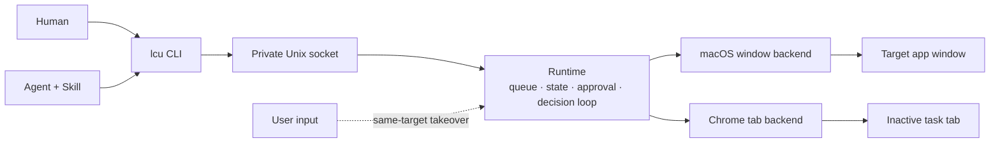

# AnythingUse

> One local control plane for anything an agent can operate.

**中文版：[README.zh-CN.md](README.zh-CN.md)**

AnythingUse is a local-first control layer for humans and Agents. **Today:** real macOS applications and the user's installed Chrome. **Future:** Windows and other endpoint types through the same command-oriented model.

**Naming:** product name is **AnythingUse**. The public CLI is still `lcu`; crates, sockets, and the CLI keep the historical **LCU** codename (`lcu`, `lcu-*`); the data root is `~/Library/Application Support/AnythingUse`.

## Why AnythingUse

Computer-use systems often take over the foreground desktop, move the real pointer, or force Agents into a browser-specific API. AnythingUse takes a different approach:

- **Shared interface:** humans and Agents use the same `lcu` command.
- **Local-first:** task state, screenshots, model inference, and approvals stay on the machine by default.
- **Coexists with the user:** background work targets a specific window or Chrome task tab instead of taking over the whole desktop.
- **Honest completion:** an action receipt is not success; a task succeeds only after explicit completion and target re-observation.
- **Endpoint-oriented:** the Runtime routes goals to a platform backend, so future endpoints do not need a new public Agent protocol.

## What works today

| Area | Current capability |
|---|---|
| macOS applications | Window capture and AX semantic actions on a strict PID + window target; unsupported background input fails closed |
| Chrome | The user's real Chrome profile via extension + Native Messaging on an inactive task tab |
| Decision maker | External Agent by default when `LCU_VISION_ACTOR` is unset/`auto`; local Qwen3-VL is optional (`--actor vlm`) |
| Scheduling | One serial FIFO queue with pause, resume, cancel, and crash recovery |
| Safety | Effect-based risk checks, GUI-bound approval, takeover detection, fail-closed window isolation |
| Persistence | Local SQLite task and event state |

These are implemented source-level contracts, not a broad real-app
compatibility or stability certification. Runtime verification remains
scenario-specific.

The current implementation is a developer build for Apple Silicon macOS (no signed installer yet).

## Architecture



The loop is `observe → decide → guard → act → observe`. `decide` is the pluggable step: with the normal unset/`auto` Runtime default, the external Agent fetches the observation (`lcu decide`) and submits one (`lcu act`); the local VLM is optional (`lcu run --actor vlm`). Both flow through the same validation, risk, and approval gates. See [Architecture](docs/architecture.md) for details.

## Quick start

```bash
# build
cargo build -p lcu-cli -p lcu-desktop --release
(cd native/macos-window-service && swift build -c release)

# start the Runtime and diagnose
./target/release/lcu-desktop &
./target/release/lcu doctor --json

# external Agent path: the Skill continues with lcu decide / lcu act
./target/release/lcu run "Open Downloads in Finder" \
  --app com.apple.finder --actor agent --json

# human/local path: requires the optional model assets below
./target/release/lcu run "Open Downloads in Finder" \
  --app com.apple.finder --actor vlm --wait --json
```

Agents use the bundled Skill; `--source` is display-only metadata.

Optional: Chrome surface — run `./native/chrome-control/scripts/install-native-host.sh`, then in `chrome://extensions` enable Developer mode and **Load unpacked** only from the `extension:` path it prints (default: `~/Library/Application Support/AnythingUse/chrome-extension`). Local VLM: `python3 -m venv .venv && .venv/bin/pip install -r requirements.txt`, then `./scripts/download_qwen3_vl.sh`.

## Install the Skill as a plugin

The `local-computer-use` skill ships as a plugin from this repo. **Install** (one of):

```bash
# Claude Code
claude plugin marketplace add HelloiOS2014/AnythingUse
claude plugin install anythinguse

# Grok Build
grok plugin install https://github.com/HelloiOS2014/AnythingUse --trust
```

**Update**:

```bash
claude plugin update anythinguse    # or: grok plugin update
```

Skill updates ride the repo; the `lcu` binaries stay a separate build.

## Non-interference model

Coexistence is not "pause whenever the target app is frontmost":

- A macOS task is bound to a specific PID and window; activation is never used as a fallback.
- If the user takes over that exact window, the task pauses and releases execution.
- Chrome work runs in an inactive task tab and never reactivates the user's tabs.
- If strict target identity cannot be maintained, the operation fails rather than guessing another window.

Apps that expose no usable Accessibility controls are currently observation-only
unless an existing PID-directed action can prove safe delivery. AnythingUse does
not defocus the user's app to make a background target accept input.

This is a product invariant. Switching to the target and switching back is not non-interference.

## Queue and completion

One serial FIFO queue per macOS login user; approval-waiting and user-paused tasks release the execution slot. A task reaches `succeeded` only when the model emits explicit `Done` **and** the target can be observed again. Repeated actions, step count, or a successful write do not complete the goal.

## Roadmap

- **Now (v3.2, on `main`):** macOS window control, real Chrome control, pluggable decision maker, CLI, Agent Skill. See [Delivery status](docs/status.md).
- **Next:** signed macOS packaging and Windows compatibility.
- **Later:** additional computers, mobile devices, remote hosts, or other controllable endpoints with a strict target and safe action model.

MCP, Playwright, public TCP, and long Top100/soak gates are **not** current product surfaces or freeze blockers.

## Repository map

```text
apps/lcu-desktop/             Runtime host and approval UI
crates/lcu-cli/               Public command surface
crates/lcu-core/              Shared contracts (actions, risk, task state, protocol)
crates/lcu-platform/          PlatformBackend trait + null backend
crates/lcu-runtime/           Queue, state, policy, and execution loop
crates/lcu-model/             Decision actors (VLM subprocess / AgentActor) + validation
crates/lcu-platform-macos/    Rust adapter for macOS control
crates/lcu-chrome/            Chrome backend adapter
native/macos-window-service/  Swift window-targeted service
native/chrome-control/        Extension and Native Messaging host
skills/local-computer-use/    Agent-facing Skill (directory name historical)
scripts/                      Model download and helper scripts
```

## Documentation

- [Delivery status](docs/status.md) · [Architecture](docs/architecture.md) · [Computer Use reference notes](docs/computer-use-reference.md) · [User guide](docs/user-guide.md) · [`lcu` command contract](docs/command-contract.md) · [Privacy](docs/privacy.md) · [Troubleshooting](docs/troubleshooting.md)
- [Agent Skill](skills/local-computer-use/SKILL.md) · [macOS window service](native/macos-window-service/README.md) · [Chrome control](native/chrome-control/README.md)
