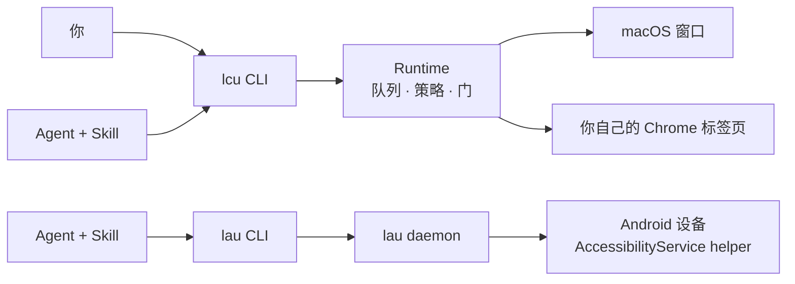

# AnythingUse

**让 Agent 操作你真实的 Mac、你真实的 Chrome，以及（源码级）你真实的 Android 手机 —— 全部在本机完成，凡是危险动作都有人把关。**

AnythingUse 是一套本地优先的控制平面。它不猜像素、也不另开一个干净的浏览器：它读你**正在用**的那个应用的无障碍树，把动作绑定到**严格的目标窗口**，并且在任何有真实后果的动作前停下来问你。没有云端、没有账号、没有遥测。

**English: [README.md](README.md)**



## 它解决什么

- **真语义，不是猜坐标。** 读的是 VoiceOver 用的同一棵无障碍树 —— 它说的是"这个按钮叫什么"，而不是"大概在哪个像素"。
- **你的真实环境。** 用的是你自己的 Chrome 配置（已登录），跑在一个非活动的任务标签页里，而不是一个什么会话都没有的新浏览器。
- **不抢你的桌面。** 任务绑定到某个 PID + 窗口，优先后台投递；只有在无法后台投递时才可能把**那一个确切窗口**切到前台（且会明确告知），你一动真键盘鼠标，任务立刻让路。
- **危险动作会停。** 发送、删除、支付、碰凭证 —— 即使在已授权的会话里，也是**单独**由人决定的一次决策；而且**批准过一次不等于以后都批**（绝不重放）。
- **完成是证明出来的。** 动作回执 ≠ 成功：只有显式 `done` **且**目标被重新观察到，任务才算 `succeeded`。

## 试一下

```bash
# 构建 + 装到 PATH（lcu、lcu-desktop、lau、macos-window-service）
cargo build -p lcu-cli -p lcu-desktop --release
(cd native/macos-window-service && swift build -c release)
./scripts/install-cli.sh

lcu doctor --json
```

`doctor` 一个调用就把前置条件讲全：

```json
{ "status": "ok",
  "data": { "runtime_reachable": true,
            "private_entry": { "kind": "unix_socket", "listens_tcp": false, "socket_mode": "600" },
            "permissions": [ { "name": "screen_recording", "state": "granted", "required_for": ["observe"] },
                             { "name": "accessibility",    "state": "granted", "required_for": ["semantic_action", "targeted_input"] },
                             { "name": "input_monitoring", "state": "granted", "required_for": ["directed_input_same_window_takeover"] } ],
            "blockers": [] } }
```

然后按 Agent 的方式跑任务 —— **一次观察只做一个决策**：

```bash
lcu run "打开下载文件夹" --app com.apple.finder --actor agent --json
lcu decide <task-id> --json                    # 紧凑元素列表 + 观察令牌（+ 0600 权限的截图路径）
lcu act  <task-id> --observation-id <obs> \
  --action '{"kind":"semantic","type":"invoke","element_id":"e12"}' \
  --effect '{"kind":"navigate","summary":"打开下载"}'
lcu result <task-id> --json                    # succeeded / failed / cancelled
```

退出码稳定且两个 CLI 一致（来自 `anything-core` 的 `ExitCode`）：
`0` 成功 · `2` 等人决定 · `3` 任务失败 · `4` 权限被拒 · `64` 用法错误 · `69` Runtime 不可用 · `70` 内部错误。

Runtime 按需启动、空闲 60 秒自行退出；只有你想让菜单栏常驻时才需要自己起 `lcu-desktop`。

## 安装

| 依赖 | 用于 |
|---|---|
| Apple Silicon Mac、Rust 工具链、Xcode 命令行工具 | 核心构建（含 Swift 窗口服务） |
| Chrome | Chrome 表面（`./native/chrome-control/scripts/install-native-host.sh`，然后按它打印的路径"加载已解压的扩展程序"） |
| Python 3 + 模型资源 | **可选**的本地 VLM 决策者（`python3 -m venv .venv && .venv/bin/pip install -r requirements.txt`，再 `./scripts/download_qwen3_vl.sh`） |
| `adb` + 一台 Android 设备 | Android 端点（`./scripts/install-android-helper.sh`，然后在"无障碍"里启用 *AnythingUse LAU*） |

macOS 会要三个权限，各自对应一项能力（`doctor` 里是同一份映射）：**屏幕录制**（观察）、**辅助功能**（语义与定向输入）、**输入监控**（感知你在目标上的真实输入，从而让路）。

## 两个端点，两个成熟度

| | `lcu` —— macOS + Chrome | `lau` —— Android |
|---|---|---|
| 成熟度 | **已交付（v3.2）**：源码对齐，集中真机验收 2026-08-17 通过 | **源码级**：验收证据是 2026-09-15 的单台设备 |
| 目标 | 某个 PID + 窗口，或一个非活动的 Chrome 任务标签页 | 一台 USB 连接的设备，按包授权 |
| 决策 | `run` / `decide` / `act` / `result`，`--actor agent`（默认）或 `--actor vlm` | `run` / `decide` / `act` / `result`（`--actor agent`） |
| 传输 | 私有 Unix socket，连按需启动的 Runtime | `adb forward` 到 App 内的无障碍服务 socket；**从不**用 ADB 注入输入 |
| 门 | 应用访问 · 后果 · 接管 | 应用访问（包名 + 签名证书）· 后果 · 接管 |
| 深入阅读 | [交付状态](docs/status.md) · [命令契约](docs/command-contract.md) | [LAU 规划](docs/lau-android-plan.md) · [验收证据](evidence/lau/phase2-acceptance-2026-09-15.md) |

`lau` 是**独立二进制**（lau = Local Android Use，绝不并入 `lcu`）；两者只共享 `crates/anything-core` 里的平台中立契约。

## 安全模型

循环永远是 **观察 → 决策 → 守卫 → 执行 → 再观察**，而守卫从不相信执行者：

- **执行者只提议，风险由 Runtime 定。** `--effect` 是闭集的意图声明；独立的证据层（macOS 看无障碍语义，Android 看控件/文案证据）**只能抬高**风险下限、不能压低。把删除谎报成"导航"，照样落到破坏性门上。
- **三道门各自独立。** 应用访问、后果（R3）、人工接管（R4）是三件事；凭证交给真人，绝不代打。**批准绝不重放** —— 过门之后必须重新观察、重新提议。
- **身份是严格的。** 动作绑定在它被决策时的那次观察上（Android 上还会逐节点复核会话令牌）。UI 变了、会话重建了，动作就 fail-closed，而不是"点到什么算什么"。
- **你的还是你的。** 你在目标上的真实输入会让任务暂停；Android 上硬件触摸监听做同样的事，监听断了也是暂停而不是盲动。凭证字段只标记、**绝不读取**其内容。
- **完成必须被证明。** `succeeded` 需要显式 `done` **加上**一次成功的重新观察。它证明的是机制，不是你的目标 —— 核对"看到的是不是你想要的"是执行者的责任。

细节：[执行契约](docs/execution-contract.md) · [架构](docs/architecture.md) · [隐私](docs/privacy.md)。

## 给 Agent 用

本仓库分发两个技能，随仓库一起更新：

```bash
# Pi
pi install git:github.com/HelloiOS2014/AnythingUse     # 或 ./scripts/install-pi.sh
# Claude Code
claude plugin marketplace add HelloiOS2014/AnythingUse && claude plugin install anythinguse
# Grok Build
grok plugin install https://github.com/HelloiOS2014/AnythingUse --trust
```

- macOS + Chrome → `local-computer-use`（[SKILL.md](skills/local-computer-use/SKILL.md)）
- Android → `local-android-use`（[SKILL.md](skills/local-android-use/SKILL.md)）

Agent 应当**直接**调用 CLI，一次观察一个决策 —— 不要套驱动脚本、不要包一层 JSON、不要碰私有 socket。硬规则与二进制解析顺序见 [AGENTS.md](AGENTS.md)。

## 状态

- **macOS 核心 —— v3.2，在 `main`：** macOS 窗口控制、真实 Chrome 控制、可插拔决策者（默认 Agent，可选本地 Qwen3-VL）、CLI、Agent Skill。见[交付状态](docs/status.md)。
- **Android —— 源码级：** 已做到可安装可分发（`lau` + helper APK + 独立技能），并经真机验证；已知缺口清单在 [LAU 规划](docs/lau-android-plan.md) §0。
- **不承诺：** 对任意应用的广泛兼容、签名/公证安装包、soak 或 Top-100 门禁、Windows、远程主机。MCP、Playwright、公网 TCP 监听也**刻意**不是产品表面。

目前选择接受的已知限制：HyperOS 在 helper 被杀后可能自行关闭无障碍服务（#17）；daemon 偶发空/截断响应（已埋点，幂等读自动重试一次、动作绝不重试）（#19）；Android 的 Spinner/下拉控件声称可滚动但实际不可操作（#27）。

## 仓库地图

```text
crates/anything-core/         平台中立契约（动作、效果、风险），lcu 与 lau 共用
crates/lcu-*/                 macOS 运行时：CLI、队列、策略、模型执行者、平台与 Chrome 后端
crates/lau-cli/               Android 端点：CLI + 按需 daemon
apps/lcu-desktop/             Runtime 宿主与审批界面
native/macos-window-service/  Swift 窗口定向服务
native/chrome-control/        Chrome 扩展 + Native Messaging 宿主
native/android-helper/        Kotlin 无障碍服务 helper APK（lau）
skills/local-computer-use/    Agent 技能 —— macOS/Chrome
skills/local-android-use/     Agent 技能 —— Android
scripts/                      安装、打包与辅助脚本
```

## 文档

[执行契约](docs/execution-contract.md) · [交付状态](docs/status.md) · [架构](docs/architecture.md) ·
[用户指南](docs/user-guide.md) · [`lcu` 命令契约](docs/command-contract.md) ·
[LAU Android 规划](docs/lau-android-plan.md) · [隐私](docs/privacy.md) · [故障排查](docs/troubleshooting.md) ·
[Computer Use 参考笔记](docs/computer-use-reference.md) ·
[macOS 窗口服务](native/macos-window-service/README.md) · [Chrome 控制](native/chrome-control/README.md)
