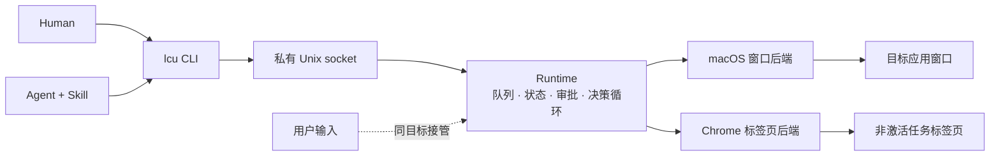

# AnythingUse

> 一个本地控制平面，供 Agent 操作任何东西。

AnythingUse 是面向人类与 Agent 的本地优先控制层。**现在：** 真实的 macOS 应用和用户已安装的 Chrome。**未来：** Windows 及其他端点类型，通过同一套命令模型扩展。

**命名说明：** 产品名是 **AnythingUse**。公开 CLI 仍是 `lcu`；crate 与 socket 沿用历史代号 **LCU**（`lcu`、`lcu-*`）；数据根目录为 `~/Library/Application Support/AnythingUse`。

## 为什么是 AnythingUse

计算机使用类系统常常抢占前台桌面、移动真实指针，或把 Agent 逼进浏览器专用 API。AnythingUse 换一种方式：

- **统一接口：** 人类与 Agent 使用同一条 `lcu` 命令。
- **本地优先：** 任务状态、截图、模型推理、审批默认都留在本机。
- **与用户共存：** 后台工作只瞄准特定窗口或 Chrome 任务标签页，不接管整个桌面。
- **诚实的完成：** 动作回执不是成功；任务只有在显式完成并经目标重观察后才成功。
- **面向端点：** Runtime 把目标路由到平台后端，未来新增端点不需要新的公开 Agent 协议。

## 当前能力

| 领域 | 能力 |
|---|---|
| macOS 应用 | 对严格 PID + 窗口目标进行截图与 AX 语义操作；无法证明安全的后台输入会 fail closed |
| Chrome | 通过扩展 + Native Messaging 在非激活任务标签页里使用用户真实 Chrome |
| 决策器 | `LCU_VISION_ACTOR` 未设置或为 `auto` 时默认由外部 Agent 决策；本地 Qwen3-VL 可按任务显式选择（`--actor vlm`） |
| 调度 | 全局串行 FIFO 队列，支持暂停、恢复、取消与崩溃恢复 |
| 安全 | 基于效果的风险检查、GUI 绑定审批、接管检测、fail-closed 窗口隔离 |
| 持久化 | 本地 SQLite 任务与事件存储 |

上表是当前源码已实现的产品契约，不是对所有真实应用兼容性或稳定性的认证；运行时验证仍按具体场景进行。

当前实现是 Apple Silicon macOS 的开发构建（尚无签名安装包）。

## 架构



循环是 `observe → decide → guard → act → observe`。`decide` 是可插拔步骤：在通常的未设置/`auto` Runtime 默认值下，外部 Agent 取观察（`lcu decide`）并提交动作（`lcu act`）；本地 VLM 可按任务显式选择（`lcu run --actor vlm`）。两者走完全相同的校验、风险与审批管线。详见 [架构](docs/architecture.md)。

## 快速开始

```bash
# 构建
cargo build -p lcu-cli -p lcu-desktop --release
(cd native/macos-window-service && swift build -c release)

# 启动 Runtime 并诊断
./target/release/lcu-desktop &
./target/release/lcu doctor --json

# 外部 Agent 路径：Skill 随后执行 lcu decide / lcu act
./target/release/lcu run "Open Downloads in Finder" \
  --app com.apple.finder --actor agent --json

# 人类/本地路径：需要先安装下方可选模型资源
./target/release/lcu run "Open Downloads in Finder" \
  --app com.apple.finder --actor vlm --wait --json
```

可选：Chrome 表面：运行 `./native/chrome-control/scripts/install-native-host.sh`，然后在 `chrome://extensions` 开启开发者模式，并仅从脚本打印的 `extension:` 路径 **Load unpacked**（默认是 `~/Library/Application Support/AnythingUse/chrome-extension`）。本地 VLM：`python3 -m venv .venv && .venv/bin/pip install -r requirements.txt`，再 `./scripts/download_qwen3_vl.sh`。

## 以插件方式安装 Skill

`local-computer-use` 技能以插件形式从这个仓库分发。**安装**（二选一）：

```bash
# Claude Code
claude plugin marketplace add HelloiOS2014/AnythingUse
claude plugin install anythinguse

# Grok Build
grok plugin install https://github.com/HelloiOS2014/AnythingUse --trust
```

**更新**：

```bash
claude plugin update anythinguse    # 或：grok plugin update
```

技能更新随仓库走；`lcu` 二进制保持独立构建。

## 非干扰模型

共存不是"目标应用在前台就暂停"：

- macOS 任务绑定到特定 PID 和窗口；不会把激活目标作为兜底策略。
- 用户接管该精确窗口时，任务暂停并释放执行。
- Chrome 工作在非激活任务标签页进行，从不重新激活用户的标签页。
- 无法维持严格目标身份时，操作失败，而不是猜测另一个窗口。

对于没有可用 Accessibility 控件的应用，当前只能观察；除非既有的 PID
定向动作能够证明安全投递。AnythingUse 不会通过让用户当前应用失焦来
迫使后台目标接收输入。

这是产品不变量。切到目标再切回去不算非干扰。

## 队列与完成

每个 macOS 登录用户一条串行 FIFO 队列；等待审批与用户暂停的任务释放执行槽。任务只有在模型显式发出 `Done` **且**目标可被再次观察时才达到 `succeeded`。重复动作、步数或一次成功写入都不算完成目标。

## 路线图

- **现在（v3.2，`main` 分支）：** macOS 窗口控制、真实 Chrome 控制、可插拔决策器、CLI、Agent Skill。见[交付状态](docs/status.md)。
- **下一步：** 签名 macOS 打包与 Windows 兼容。
- **更远：** 其他计算机、移动设备、远程主机或任何能提供严格目标与安全动作模型的可控端点。

MCP、Playwright、公共 TCP 与长周期 Top100/soak 门槛**不是**当前产品表面或冻结阻塞项。

## 仓库地图

```text
apps/lcu-desktop/             Runtime 宿主与审批 UI
crates/lcu-cli/               公开命令面
crates/lcu-core/              共享契约（动作、风险、任务状态、协议）
crates/lcu-platform/          PlatformBackend trait + 空后端
crates/lcu-runtime/           队列、状态、策略与执行循环
crates/lcu-model/             决策 actor（VLM 子进程 / AgentActor）+ 校验
crates/lcu-platform-macos/    macOS 控制的 Rust 适配器
crates/lcu-chrome/            Chrome 后端适配器
native/macos-window-service/  Swift 窗口定向服务
native/chrome-control/        扩展与 Native Messaging 宿主
skills/local-computer-use/    Agent 技能（目录名沿用历史）
scripts/                      模型下载与辅助脚本
```

## 文档

- [交付状态](docs/status.md) · [架构](docs/architecture.md) · [Computer Use 参考笔记](docs/computer-use-reference.md) · [用户指南](docs/user-guide.md) · [`lcu` 命令契约](docs/command-contract.md) · [隐私](docs/privacy.md) · [故障排查](docs/troubleshooting.md)
- [Agent Skill](skills/local-computer-use/SKILL.md) · [macOS 窗口服务](native/macos-window-service/README.md) · [Chrome 控制](native/chrome-control/README.md)
