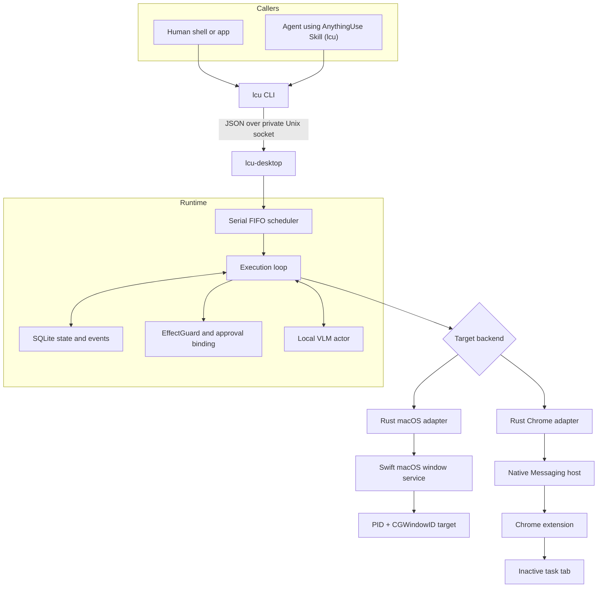
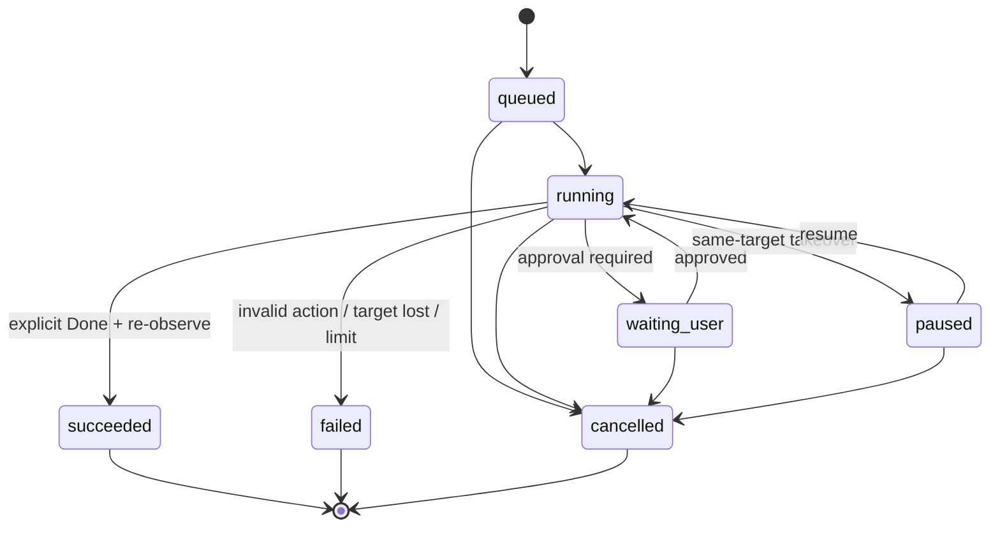

# AnythingUse Architecture

CLI and on-disk paths still use the **LCU** / `LocalComputerUse` codename; see [Delivery status](status.md) for the naming map.

## Design goals

AnythingUse provides one local command surface for user- and Agent-originated control tasks. The current product targets macOS applications and Chrome, while keeping the endpoint boundary small enough to support other platforms later.

The architecture prioritizes:

- strict target identity;
- coexistence with active user work;
- local data and inference;
- one understandable execution queue;
- explicit, observable completion;
- no second privileged protocol for Agents.

## Components



Only the `lcu` CLI is public to callers. Runtime, macOS, and Chrome sockets are private implementation details.

## Task lifecycle



Wire state names match the Runtime JSON: `waiting_user` (Rust variant `WaitingApproval`; legacy alias `waiting_approval`), `paused` (alias `paused_by_user`), and `cancelled`.

The scheduler executes one automatic task at a time. `waiting_user` and user-paused tasks do **not** hold the execution slot; after approval or resume the task returns to `running` (it is not re-queued as a new job).

## Execution loop

Each product step follows one path:

```text
resolve target
    → control-state gate
    → observe target
    → propose one action
    → control-state gate
    → validate observation binding and risk
    → act
    → observe again
```

The VLM receives a current screenshot, compact semantic elements, the full goal, the step number, and a factual summary of the previous action.

Task success is deliberately narrow: only explicit `Done` can enter the success branch, and the backend must still be able to observe the same target. Repeated writes or model loops fail instead of being converted into success.

## Control surfaces

### macOS window backend

The Swift service resolves a concrete target using PID and `CGWindowID`. Accessibility actions and window capture operate against that target.

Rules:

- do not activate the application as an execution strategy;
- do not fall back to another focused or first window when identity fails;
- directed input must remain bound to the same target;
- same-window user takeover pauses the task;
- target loss fails safely.

### Chrome backend

Chrome control uses the user's installed browser rather than a separate automation profile.

The extension creates or owns an inactive task tab, while Native Messaging connects it to the local Runtime. A tab/debugger lease is released on completion, cancellation, failure, or takeover. The backend does not restore focus by activating another tab.

### Future endpoints

A future endpoint needs to implement the same behavioral responsibilities:

1. resolve a strict target;
2. observe it without exposing private raw state to callers;
3. validate and execute a bounded action;
4. report takeover or target loss;
5. release resources deterministically.

It does not require a new Agent-facing protocol.

## Security and privacy boundaries

- No public TCP listener.
- Runtime sockets use local filesystem permissions.
- Screenshots and semantic trees are not returned through normal CLI results.
- High-risk actions require a GUI-bound approval tied to task, observation, action, target, expiry, and nonce.
- Agent source metadata is display-only and does not grant authority.
- Model output is treated as untrusted input and validated before execution.
- Local model subprocess isolation is not described as an OS sandbox.

See [Privacy](privacy.md) and the [command contract](command-contract.md) for details.
