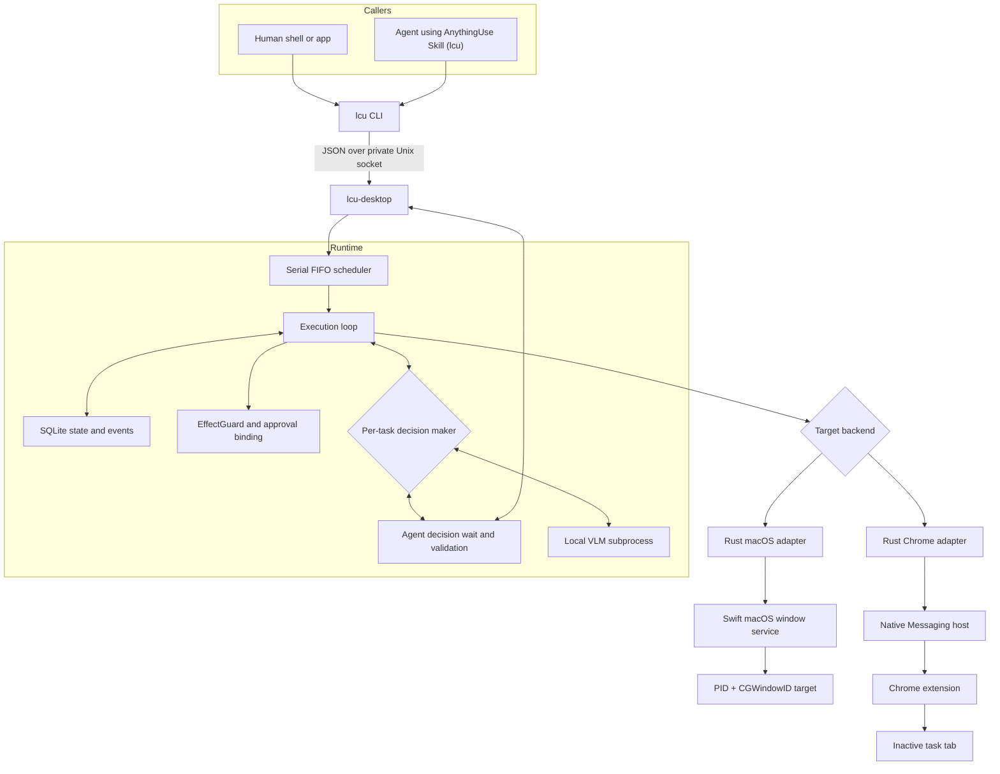
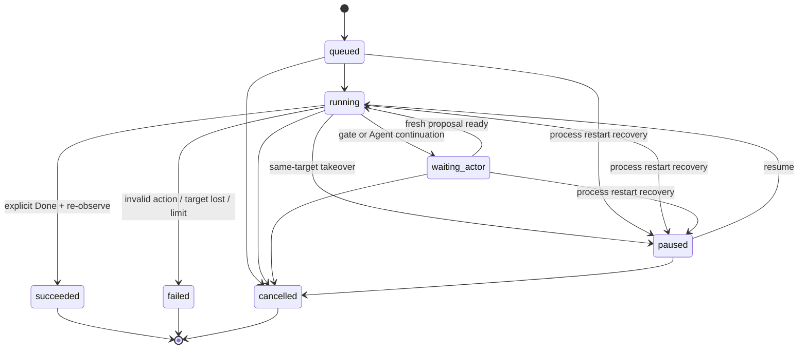

# AnythingUse Architecture

The CLI and crates keep the historical **LCU** codename (`lcu`, `lcu-*`); the data root is `~/Library/Application Support/AnythingUse`. See [Delivery status](status.md) for the naming map.

## Design goals

AnythingUse provides one local command surface for user- and Agent-originated control tasks. The current product targets macOS applications and Chrome, while keeping the endpoint boundary small enough to support other platforms later.

The architecture prioritizes:

- strict target identity;
- coexistence with active user work;
- local data and inference;
- one understandable execution queue;
- explicit, observable completion;
- no second privileged protocol for Agents.

This document records the implemented source-level architecture and command
contract. It is not evidence that every real application has stable runtime
behavior; that requires target-specific verification.

The reference comparison and rejected screenshot-only Operator candidate are
tracked in [Computer Use Reference Notes](computer-use-reference.md). This page
records only the accepted current-state architecture.

## Components



Only the `lcu` CLI is public to callers. Runtime, macOS, and Chrome sockets are private implementation details.

The decision maker is selected per task and is independent of who submitted
the task. External Agent and local VLM tasks use the same queue, observation
and action contracts, safety gates, and execution backends. They are two
decision paths, not two Computer Use implementations.

## Task lifecycle



On startup, any non-terminal task left by a dead process is recovered to
`paused` (with a rebuilt step budget), so the user decides via resume/cancel;
recovered paused tasks do not occupy queue slots.

Wire state names match the Runtime JSON: `waiting_actor` (older persisted aliases
`waiting_user` / `waiting_approval`), `paused` (alias `paused_by_user`), and
`cancelled`.

The scheduler executes one desktop action at a time. `waiting_actor` and paused
tasks do **not** hold the global execution slot; an external Agent continuation
retains only its strict target reservation. A gate decision discards the old
proposal, captures a fresh observation, and returns it to the same Actor. At
most one foreground session exists at any time.

The task-scoped foreground capability survives an external-Agent decision, but
native ownership does not: it is suspended while the Actor thinks. Resume never
activates an app and succeeds only when the same exact window is still
foreground and the native HID monitor observed no user input.
The native service increments a session epoch on sleep/wake or login-session
activation changes; Runtime pauses only tasks holding temporary target/grant
state and releases those resources before any later action.

## Execution loop

Each product step follows one path:

```text
resolve target
    → control-state gate
    → observe target
    → propose one action
    → control-state gate
    → validate observation binding + closed-set effect + independent risk floor
    → act
    → observe again
```

The decision maker — either the local VLM subprocess or an external Agent
(`--actor agent`, driving `lcu decide` / `lcu act`) — receives a
current screenshot, compact semantic elements, the full goal, the step
number, and a factual summary of the previous action. Both plug into the
same `VisionActor` interface and their proposals flow through identical
validation, EffectGuard, approval, and control gates.

Task success is deliberately narrow: only explicit `Done` can enter the success branch, and the backend must still be able to observe the same target. Repeated writes or model loops fail instead of being converted into success.

## Control surfaces

### macOS window backend

The Swift service resolves a concrete target using PID and `CGWindowID`. Accessibility actions and window capture operate against that target. The following are source-level backend rules, not separate runtime acceptance evidence.

Rules:

- background semantic first, then provably isolated background targeted input;
  activation is used only inside one GUI-approved foreground session;
- do not fall back to another focused or first window when identity fails;
- directed input must remain bound to the same target;
- real user HID on the reserved window pauses the task;
- target loss fails safely.

**Foreground session (single slot, GUI-approved):** the Runtime keeps one
`(task_id, pid, window_id)` session slot. It starts only after a task-scoped
foreground grant (`auto` after `foreground_required`, or `foreground` at task
start) and is cleared on terminal / pause / target change / release /
runtime recovery. The Swift service mirrors it in a single slot; while active,
the agent's own promotion is neither a FocusGuard steal nor user takeover, and
`foreground_activate` (the only `NSRunningApplication.activate` entry) must
raise or uniquely prove the exact window before activation and re-prove it
after activation and before every directed input. The previous app is never
restored. Real user HID on the target ends the session and pauses the task
automatically; focus changes without target HID are not takeover. Ordinary actions
inside an approved session do not repeat capability approval; consequences use
separate one-time confirmation or takeover gates.

### Chrome backend

Chrome control uses the user's installed browser rather than a separate automation profile. This is a source-level execution design; real-profile coexistence is verified separately.

The extension creates or owns an inactive task tab, while Native Messaging connects it to the local Runtime. Its profile-local stable key, tab lease, and current page scope bind the target. Chrome surface ownership is serial FIFO; unrelated macOS targets may run while a Chrome Agent waits. A tab/debugger lease is released on completion, cancellation, failure, or takeover. The backend does not restore focus by activating another tab.

### Future endpoints

A future endpoint needs to implement the same behavioral responsibilities:

1. resolve a strict target;
2. observe it without exposing private raw state to callers;
3. validate and execute a bounded action;
4. report takeover or target loss;
5. release resources deterministically.

It does not require a new Agent-facing protocol.

## Security and privacy boundaries

- No public TCP listener.
- Runtime sockets use local filesystem permissions.
- Screenshots and semantic trees are not returned through normal CLI results.
- App access, foreground activation, and consequence confirmation/takeover are
  distinct GUI-bound grants. Consequence matching uses Runtime-derived identity;
  screenshot-only input additionally requires exact fresh image/action evidence.
- Agent source metadata is display-only and does not grant authority.
- Model output is treated as untrusted input and validated before execution.
- Local model subprocess isolation is not described as an OS sandbox.

See [Privacy](privacy.md) and the [command contract](command-contract.md) for details.
