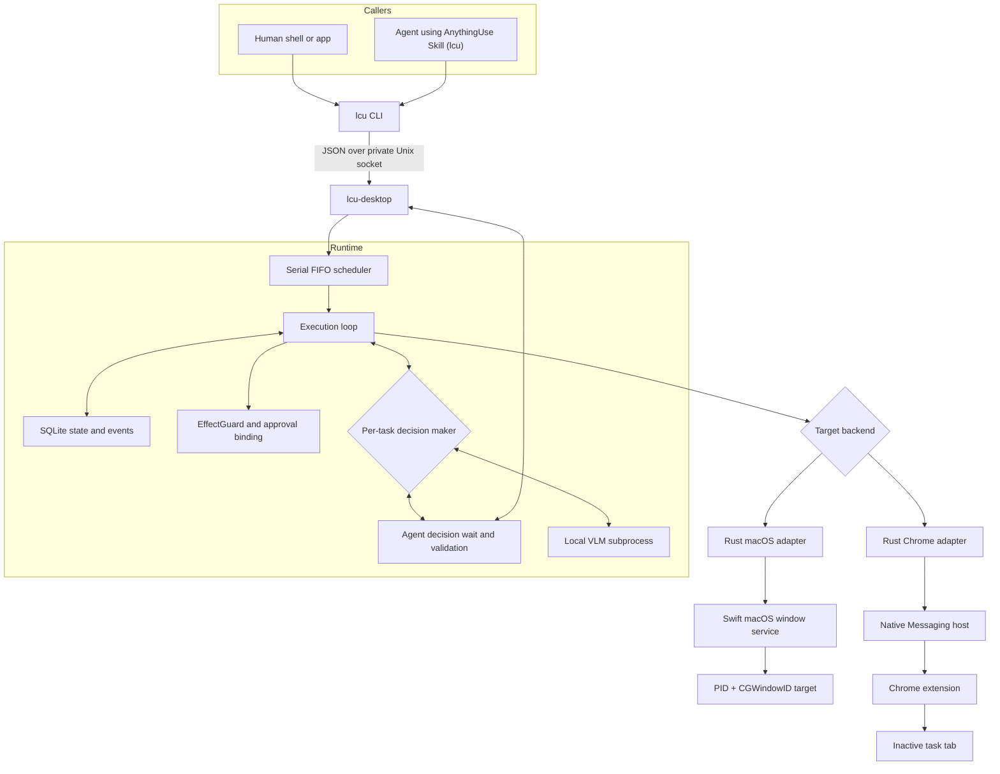
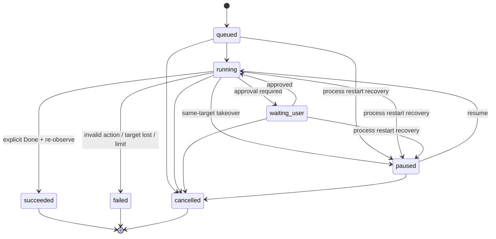

# AnythingUse Architecture

The CLI and crates keep the historical **LCU** codename (`lcu`, `lcu-*`); the data root is `~/Library/Application Support/AnythingUse`. See [Delivery status](status.md) for the naming map.

## Design goals

AnythingUse provides one local command surface for user- and Agent-originated control tasks. The current product targets macOS applications and Chrome, while keeping the endpoint boundary small enough to support other platforms later.

The architecture prioritizes:

- strict target identity;
- coexistence with active user work;
- local data and inference;
- one understandable execution queue;
- explicit, observable completion;
- no second privileged protocol for Agents.

This document records the implemented source-level architecture and command
contract. It is not evidence that every real application has stable runtime
behavior; that requires target-specific verification.

The approved target contract and minimal execution-layer rework are tracked in
[Computer Use Reference Notes](computer-use-reference.md). This page remains the
current-state architecture until that plan is implemented and accepted.

## Components



Only the `lcu` CLI is public to callers. Runtime, macOS, and Chrome sockets are private implementation details.

The decision maker is selected per task and is independent of who submitted
the task. External Agent and local VLM tasks use the same queue, observation
and action contracts, safety gates, and execution backends. They are two
decision paths, not two Computer Use implementations.

## Task lifecycle



On startup, any non-terminal task left by a dead process is recovered to
`paused` (with a rebuilt step budget), so the user decides via resume/cancel;
recovered paused tasks do not occupy queue slots.

Wire state names match the Runtime JSON: `waiting_user` (Rust variant `WaitingApproval`; legacy alias `waiting_approval`), `paused` (alias `paused_by_user`), and `cancelled`.

The implemented scheduler executes one automatic task at a time. `waiting_user` and user-paused tasks do **not** hold the execution slot; after approval or resume the task returns to `running` and is re-enqueued on the same FIFO (state goes back to `running`, not to `queued`).

## Execution loop

Each product step follows one path:

```text
resolve target
    → control-state gate
    → observe target
    → propose one action
    → control-state gate
    → validate observation binding and risk
    → act
    → observe again
```

The decision maker — either the local VLM subprocess or an external Agent
(`--actor agent`, driving `lcu decide` / `lcu act`) — receives a
current screenshot, compact semantic elements, the full goal, the step
number, and a factual summary of the previous action. Both plug into the
same `VisionActor` interface and their proposals flow through identical
validation, EffectGuard, approval, and control gates.

Task success is deliberately narrow: only explicit `Done` can enter the success branch, and the backend must still be able to observe the same target. Repeated writes or model loops fail instead of being converted into success.

## Control surfaces

### macOS window backend

The Swift service resolves a concrete target using PID and `CGWindowID`. Accessibility actions and window capture operate against that target. The following are source-level backend rules, not separate runtime acceptance evidence.

Rules:

- do not activate the application as an execution strategy;
- do not fall back to another focused or first window when identity fails;
- directed input must remain bound to the same target;
- same-window user takeover pauses the task;
- target loss fails safely.

### Chrome backend

Chrome control uses the user's installed browser rather than a separate automation profile. This is a source-level execution design; real-profile coexistence is verified separately.

The extension creates or owns an inactive task tab, while Native Messaging connects it to the local Runtime. A tab/debugger lease is released on completion, cancellation, failure, or takeover. The backend does not restore focus by activating another tab.

### Future endpoints

A future endpoint needs to implement the same behavioral responsibilities:

1. resolve a strict target;
2. observe it without exposing private raw state to callers;
3. validate and execute a bounded action;
4. report takeover or target loss;
5. release resources deterministically.

It does not require a new Agent-facing protocol.

## Security and privacy boundaries

- No public TCP listener.
- Runtime sockets use local filesystem permissions.
- Screenshots and semantic trees are not returned through normal CLI results.
- High-risk actions require a GUI-bound approval tied to task, observation, action, target, expiry, and nonce.
- Agent source metadata is display-only and does not grant authority.
- Model output is treated as untrusted input and validated before execution.
- Local model subprocess isolation is not described as an OS sandbox.

See [Privacy](privacy.md) and the [command contract](command-contract.md) for details.
