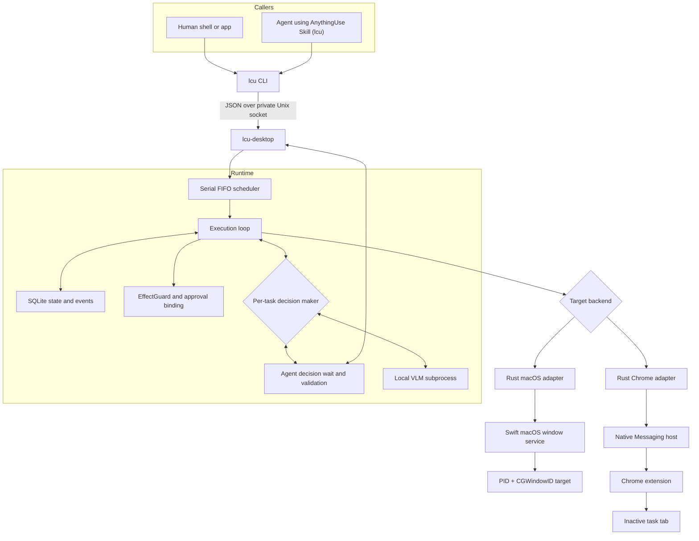
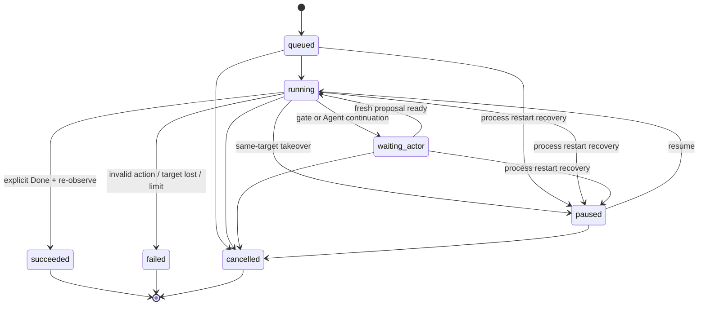
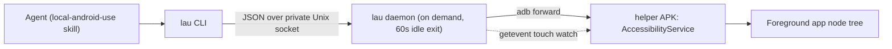

# AnythingUse Architecture

The CLI and crates keep the historical **LCU** codename (`lcu`, `lcu-*`); the data root is `~/Library/Application Support/AnythingUse`. See [Delivery status](status.md) for the naming map.

## Design goals

AnythingUse provides one local command surface for user- and Agent-originated control tasks. The current product targets macOS applications and Chrome, while keeping the endpoint boundary small enough to support other platforms later.

The architecture prioritizes:

- strict target identity;
- coexistence with active user work;
- local data and inference;
- one understandable execution queue;
- explicit, observable completion;
- no second privileged protocol for Agents.

This document records the currently implemented source architecture. The
normative migration target is the [Execution Contract](execution-contract.md);
[Delivery status](status.md) states which parts have reached source and runtime
verification.

External comparisons are kept separately in the non-normative
[Computer Use Reference Notes](computer-use-reference.md).

## Components



Only the `lcu` CLI is public to callers. Runtime, macOS, and Chrome sockets are private implementation details.

The decision maker is selected per task and is independent of who submitted
the task. External Agent and local VLM tasks use the same queue, observation
and action contracts, safety gates, and execution backends. They are two
decision paths, not two Computer Use implementations.

## Task lifecycle



On startup, any non-terminal task left by a dead process is recovered to
`paused` (with a rebuilt step budget), so the user decides via resume/cancel;
recovered paused tasks do not occupy queue slots.

Wire state names match the Runtime JSON: `waiting_actor` (older persisted aliases
`waiting_user` / `waiting_approval`), `paused` (alias `paused_by_user`), and
`cancelled`.

The scheduler executes one desktop action at a time. `waiting_actor` and paused
tasks hold neither the global execution slot nor a generic PID/window
reservation. Continuation re-resolves and re-observes the target. A gate
decision discards the old proposal and returns a fresh observation to the same
Actor.

The listen-only native HID monitor remains independent of foreground state and
invalidates work when real user input touches the controlled target.
The native service increments a session epoch on sleep/wake or login-session
activation changes; Runtime pauses only tasks holding temporary target/grant
state and releases those resources before any later action.

## Execution loop

Each product step follows one path:

```text
resolve target
    → control-state gate
    → observe target
    → propose one action
    → control-state gate
    → validate observation binding + closed-set effect + independent risk floor
    → act
    → observe again
```

The decision maker — either the local VLM subprocess or an external Agent
(`--actor agent`, driving `lcu decide` / `lcu act`) — receives a
current screenshot, compact semantic elements, the full goal, the step
number, and a factual summary of the previous action. Both plug into the
same `VisionActor` interface and their proposals flow through identical
validation, EffectGuard, approval, and control gates.

Task success is deliberately narrow: only explicit `Done` can enter the success branch, and the backend must still be able to observe the same target. Repeated writes or model loops fail instead of being converted into success.

## Control surfaces

### macOS window backend

The Swift service resolves a concrete target using PID and `CGWindowID`. Accessibility actions and window capture operate against that target. The following are source-level backend rules, not separate runtime acceptance evidence.

Rules:

- background semantic first, then provably isolated background targeted input;
  `auto` may activate only the exact app-access-permitted target when the
  backend reports `foreground_required`; `background_only` fails instead;
- do not fall back to another focused or first window when identity fails;
- directed input must remain bound to the same target;
- real user HID on the reserved window pauses the task;
- target loss fails safely.

**Foreground fallback:** app access discloses that `auto` may activate the
exact target when verified background delivery is unavailable. Runtime then
discards the old proposal. `foreground_activate` is the only AppKit activation
entry; it must prove the exact window after
activation and before directed input. The previous app is never restored.
Real user HID on the target pauses the task; consequences retain separate
one-time confirmation or takeover gates.

### Chrome backend

Chrome control uses the user's installed browser rather than a separate automation profile. This is a source-level execution design; real-profile coexistence is verified separately.

The extension creates or owns an inactive task tab, while Native Messaging connects it to the local Runtime. Its profile-local stable key, tab lease, and current page scope bind the target. Chrome surface ownership is serial FIFO; unrelated macOS targets may run while a Chrome Agent waits. A tab/debugger lease is released on completion, cancellation, failure, or takeover. The backend does not restore focus by activating another tab.

### Android endpoint (`lau`)

A separate CLI (`crates/lau-cli`, binary `lau`) drives one USB-connected Android
device. It shares the platform-neutral contracts in `crates/anything-core`
(actions, effects, risk levels, schema) and **nothing else** with the macOS
runtime — the two never call each other.



- The **daemon** owns task state, the per-device serial queue, the approval gates
  (application access, consequence, R4 takeover) and the Android evidence layer;
  it lives only while tasks do and exits after 60 idle seconds.
- The **helper** is a Kotlin AccessibilityService reachable over an abstract
  socket on the device. ADB is transport and observation only — never input
  injection, and coordinate actions are refused outright.
- Every action is bound to a session-scoped observation token
  (`<sessionId>:<generation>`) re-verified against seven checks before it runs,
  and a dead hardware-touch watch fails closed.
- The Agent surface is the decision loop (`run` / `decide` / `act` / `result`);
  the stateless commands (`dump`, `invoke`, `set-value`, `scroll`, `screenshot`)
  carry no task context, so no gate applies to them.

### Future endpoints

A further endpoint needs to implement the same behavioral responsibilities:

1. resolve a strict target;
2. observe it without exposing private raw state to callers;
3. validate and execute a bounded action;
4. report takeover or target loss;
5. release resources deterministically.

The Android endpoint above implements all five; a new platform does not require
a new Agent-facing protocol.

## Security and privacy boundaries

- No public TCP listener.
- Runtime sockets use local filesystem permissions.
- Screenshots and semantic trees are not returned through normal CLI results.
- App access and consequence confirmation/takeover are distinct GUI-bound
  decisions. App access discloses foreground fallback. Consequence matching uses Runtime-derived identity;
  screenshot-only input additionally requires exact fresh image/action evidence.
- Agent source metadata is display-only and does not grant authority.
- Model output is treated as untrusted input and validated before execution.
- Local model subprocess isolation is not described as an OS sandbox.

See [Privacy](privacy.md) and the [command contract](command-contract.md) for details.
